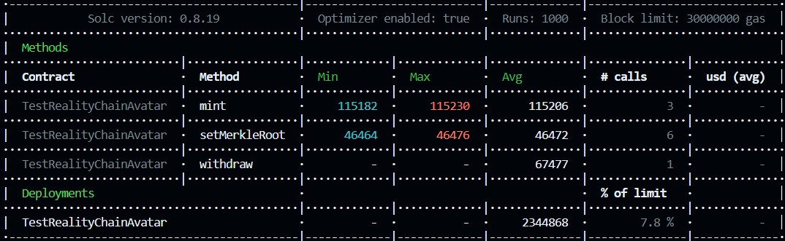

# NFT Minting Random
This is a Smart contract NFT project that using minting random concept using [ERC721R library](https://medium.com/@dumbnamenumbers/erc721r-a-new-erc721-contract-for-random-minting-so-people-dont-snipe-all-the-rares-68dd06611e5) to get token ID randomly.

## Features
1. Free minting: This phase is free minting but the NFT is cannot tradeable by the time that setup from owner. Each address will only get 1 NFT.
2. Rserve: Holders will reserve nft tokens but they do not directly get the nft and only reserve tokens. Each Address only have 2 NFT.
3. Guaranteed: Normal minting with low prices and each address only has the opportunity to get 2 NFTs.
4. FCFS: Like the public minting feature, this feature is also like normal minting but has a higher price.
5. Claiming Reserve: This feature is only open on FCFS where addresses that have reserved before can claim tokens for the number of tokens that were reserved.
6. Airdrop: This function is only performed by the owner who can provide tokens to the specified address and then supply them based on the minting phase determined by the owner.


## Getting Started

First, install all the pakages:

```bash
yarn 
```

You can start copiying the file and modifying `.env.example`. The file must be raname to `.env`.
## Requirements :

- Collection Uri Prefix
    you can use my dummy data for NFT to try this project `ipfs://QmayPxabgZjQYEqkKdMLfHwp6hZawDHERQRCBjPwKLM1cF/`
- Network server (Infura, Achemy, etc)
    In this section you need 2 server for testnet and mainnet. Use Rinkeby for testnet and mainnet for mainnet. You must have an account and make an API in HTTP. To more information [klik here](https://docs.alchemy.com/alchemy/introduction/getting-started)
- Private wallet address 
    To get the private key, see [this](https://metamask.zendesk.com/hc/en-us/articles/360015289632-How-to-Export-an-Account-Private-Key)
- Block Explorer (Etherscan for Ethereum, etc)
    You must have an account and make an API in HTTP. To make and API you can see in this [video](https://www.youtube.com/watch?v=QDeAQa-75xs)

## Implementation

1. Rename contract
    Rename the smart contract first using terminal and run:
    ```bash
    yarn rename-contract
    ```
2. Modify `config/CollectionConfig.ts`
    Modify that file to setting like token symbol, hidden metadata URI, sale price and maximum amount per transaction.
    You can use my dummy hidden metadata to use it `ipfs://QmayPxabgZjQYEqkKdMLfHwp6hZawDHERQRCBjPwKLM1cF/`
3. Deploy the contract
    Open terminal and use this CLI to try testnet:
    ```bash
    yarn deploy --network <your network>
    ```
    You can place `<your network>` to `testnet` to try testnet like Rinkeby, Ropsten, etc and `mainnet` to use real ethereum. 
    The system will pop up the transaction hash, copy it and paste to `config/CollectionConfig.ts` on property `contractAddress` (string)
4. Verify the smart contract
    Use this CLI:
    ```bash
    yarn verify <transaction hash> --network <your network>
    ```
    `<transaction hash>` place to transaction hash that you get from deploy.
    the output will show the link to [etherscan](https://rinkeby.etherscan.io/)

###### Dont forget to close the feature to make your smart contract save 

## Function Public API

### Whitelist Mint
Whitelist mint is public function that not every one can mint. The wallet address is need to determined before and set the merkleRoot and it is for verify sistem security. Have 3 mint phase, `freeMint`, `reserve`, and `guaranted`.
```http
  whitelistMint(PhaseMint, mintAmount, _merkleProof)
```  
| Parameter | Type     | Description                |
| :-------- | :------- | :------------------------- |
| `PhaseMint` | `uint8` | Determines which phase mint to run. `int 1` for freeMint, `int 2` for reserve mint, and `int 3` for guaranteed mint` |
| `mintAmount` | `uint256` | how many token want to mint. But it still controled by mint phase. |
| `_merkleProof` | `bytes32[]` | For verifying that the wallet address is the address that can mint. It depends the phase mint that will be running  |

### Public mint
Public mint is `fcfs mint phase`. And every one can mint in this state but only 2 NFT can hold.
```http
  publicMint(mintAmount)
```
| Parameter | Type     | Description                |
| :-------- | :------- | :------------------------- |
| `mintAmount` | `uint256` | how many token want to mint. max is 2 tokens because every wallet address is allowed to have 2 NFTs|

### Claim Reserve
This function is from `reserve mint` in whitelist.
```http
  claimReverse(_merkleProof)
```
| Parameter | Type     | Description                |
| :-------- | :------- | :------------------------- |
| `_merkleProof` | `bytes32[]` | For verifying that the wallet address is the address that can mint. It is from `reserve mint phase` |

### Airdrops
Only owner can run this function. This is function mint that owner want to give token freely that which spesified address.
```http
  airdrops(to, mintAmount)
```
| Parameter | Type     | Description                |
| :-------- | :------- | :------------------------- |
| `to` | `address` | the destination of wallet address want to give NFT |
| `mintAmount` | `uint256` | how many token owner want to give |

## Function Admin (Owner) API

### Set MerkleRoot
This function is for update the merkleRoot in whitelist mint for verify sistem
```http
  setMerkleRoot(PhaseMint, merkleRoot)
```  
| Parameter | Type     | Description                |
| :-------- | :------- | :------------------------- |
| `PhaseMint` | `uint8` | Determines which phase mint to run. `int 1` for freeMint, `int 2` for reserve mint, and `int 3` for guaranteed mint` |
| `merkleRoot` | `bytes32` | the merkleRoot to be base for verify  |

### Set Pause Contract
This function will pause all public function in the smart contract
```http
  setPauseContract(toggle)
```
| Parameter | Type     | Description                |
| :-------- | :------- | :------------------------- |
| `toggle` | `bool` | `true` is off, `false` is on|

### Set Hidden Metadata
This function is to set URI genesis.
```http
  setHiddenMetadata(_hiddenMetadata)
```
| Parameter | Type     | Description                |
| :-------- | :------- | :------------------------- |
| `_hiddenMetadata` | `string` | the format URI is : `"ipfs://<CID>/<name_file>.json"` |

### Set Base URI
This function is set base URI metadata art. this is also for reveal phase 2 and pahse 3.
```http
  setBaseUri(_newUriPrefix)
```
| Parameter | Type     | Description                |
| :-------- | :------- | :------------------------- |
| `_newUriPrefix` | `string` | the format URI is : `"ipfs://<CID>/"` |

### Set Revealed
This function is to reveal the metadata or the art in opensea
```http
  setRevealed(_toggle)
```
| Parameter | Type     | Description                |
| :-------- | :------- | :------------------------- |
| `_toggle` | `bool` | `true` return baseURI, `false` return hiddenMetadata |

### Withdraw
This function is drain the fund. The rule is smart contract need to be paused.
```http
  Withdraw()
```


## Gass Fee
Wen we run the unit testing, it will appear the table of gass fee will be use for the smart contract. And in this update the gass fee esplaine in image table bellow


## Change it before deploy in mainet
1. private key
2. Block explorer API to Ethereum
3. check the prefix and hidden metadata
4. name token and symbol
5. address to withdrawal
6. royalty address and percentage
7. rename smart contract file (LOGverse)
8. market place identifier
    


